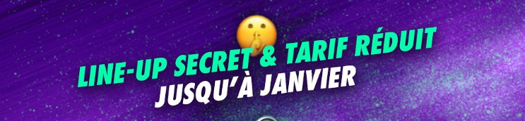
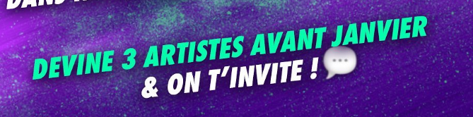
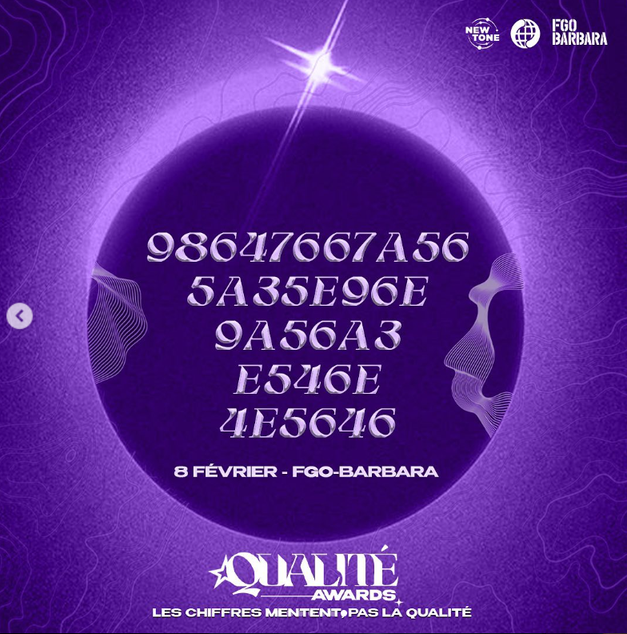
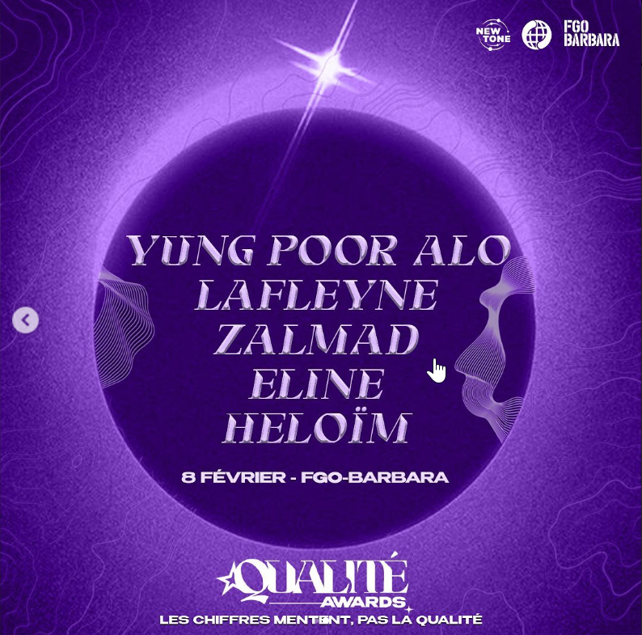

# Déchiffrage de la programmation d'un concert 

- [Contexte](#Contexte-)
- [Problème](#Problème-)
- [Solution](#Solution-)

## Contexte :
Le média rap [New-Tone](https://www.new-tone.fr) surtout présent sur [instagram](https://www.instagram.com/newtone.scope/)  est un média que j'aime :purple_heart: . Il me fait découvrir des artistes qui sont très **peu connus** mais très talentueux et incatégorisables. On pourrait les décrire comme du *rap new wave* dont je suis très fan ([mon spotify](https://open.spotify.com/user/kilaposhi?si=9c4a7807956346c1) :notes:).
  
>New-Tone se décrit de cette façon : "Il aborde la musique sur un nouveau ton en présentant les artistes de demain à une communauté réunie par la culture Hip Hop."
  
Fin décembre 2023, New-Tone annonce dans un [post insta](https://www.instagram.com/p/Cl6anVzt1lw/?utm_source=ig_web_copy_link) l'organisation d'une soirée avec 5 artistes ! Mais les artistes sont secrets, cachés derrière un chiffrage et les places sont moins chères pour remercier la confiance du public.  

De plus si l'on devine les artistes, la place est **offerte** !  :star2: 

Donc mon objectif était tout tracé et j'ai décidé de décrypter ce *line-up* à l'aide de python pour pouvoir passer une **bonne soirée**. :fire:

## Problème :

 

# Solution :

